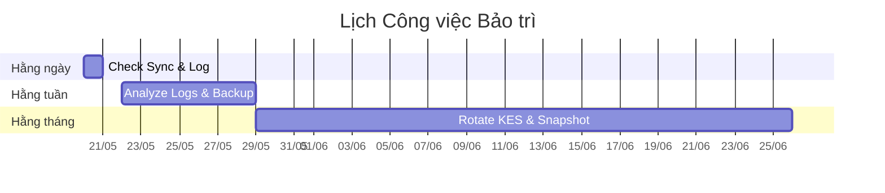
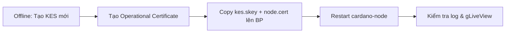
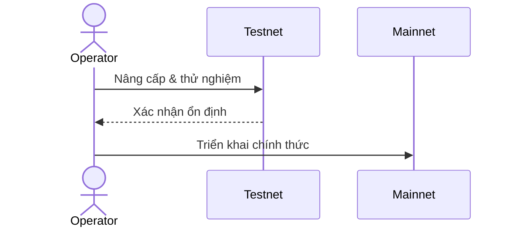
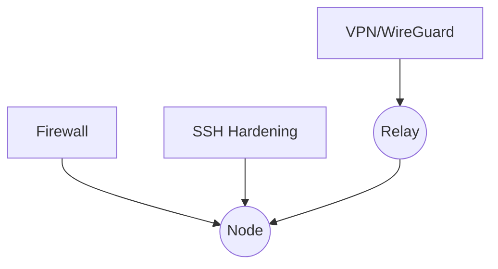
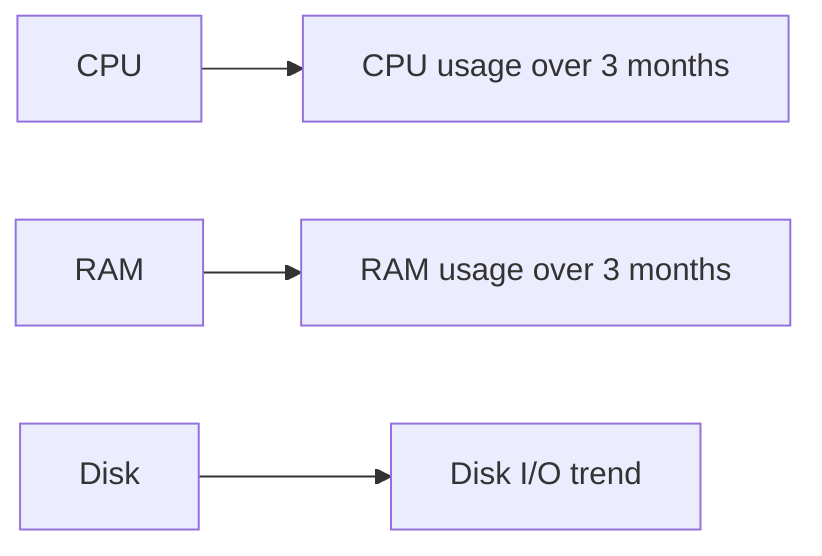

# 📗 Hướng dẫn Bảo trì và Vận hành Node & Stakepool Cardano

Một hệ thống Cardano node và stakepool hoạt động liên tục đòi hỏi quy trình bảo trì, giám sát, bảo mật và tự động hóa sát sao. Tài liệu này tổng hợp các công việc cần thực hiện cho các môi trường chính: **mainnet**, **testnet**, **VPS/Cloud**, **Bare-metal**, và **Docker**.

---

## 📅 1. Lịch Công việc Định kỳ



| Chu kỳ    | Công việc chính                |
| --------- | ------------------------------ |
| Hằng ngày | - Kiểm tra sync & tip distance |

* Xem log node & giám sát tài nguyên
* Kiểm tra leader schedule & KES đếm ngược |
  \| Hằng tuần | - Phân tích log chi tiết
* Kiểm tra kết nối P2P
* Sao lưu nhanh khóa & config
* Cập nhật OS (vá bảo mật) |
  \| Hằng tháng| - Rotate khóa KES
* Snapshot hệ thống/DB
* Kiểm tra bảo mật & firewall
* Cập nhật node & CLI
* Đánh giá hiệu quả pool |

---

## 📈 2. Giám sát Node (Logs, Metrics, Alerts)

### Log Monitoring

* **Systemd Journal**:

  ```bash
  journalctl -fu cardano-node
  ```
* **Log Filter**: Lọc bỏ dòng thông báo tip cập nhật (INFO) để tập trung lỗi.
* **ELK/Graylog**: Tích hợp để phân tích log, tìm pattern lỗi.

### Metrics & Dashboard

* **Prometheus**: Thu thập metrics từ node (`12798`) và Node Exporter (`9100`).
* **Grafana Dashboard**:

  * Độ trễ đồng bộ (Tip Delay)
  * CPU, RAM, Disk I/O
  * KES Remaining
  * Connection In/Out
  * Pool Leader Slots

### Alerts

* Cấu hình Alertmanager/Grafana Alert:

  * Node Down
  * High CPU/RAM/Disk
  * Tip Distance > N slots
  * KES < 14 days

---

## 🔑 3. Quản lý Khóa KES Định kỳ

### Quy trình Rotate KES



* **Lên lịch**: Thực hiện khi KES < 30 ngày
* **Kiểm tra**: Dùng `gLiveView` hoặc log để xác nhận reset counter.

---

## 💾 4. Sao lưu Dữ liệu

* **Khóa & Cert**: Staked Pool Cold Key, VRF Key, KES Key & Certificates
* **Config**: `mainnet-config.json`, `topology.json`, scripts
* **Chain DB** (tuỳ chọn): Snapshot định kỳ hoặc backup volume
* **Phương pháp**: 3-2-1 Backup (3 bản sao, 2 phương tiện, 1 off-site)

---

## 🔄 5. Cập nhật Node & CLI An toàn



* **Watch Release** repo cardano-node
* **Testnet** trước production
* **Backup** binary cũ
* **Restart** node & kiểm tra version

---

## 🔐 6. Bảo mật Hệ thống



* **OS Patching**: Unattended-upgrades hoặc weekly patches
* **Firewall**: UFW/Iptables, chỉ mở cổng cần thiết
* **SSH**: Đổi port, key-only, Disable root, Fail2Ban
* **Network Segmentation**: BP on private LAN/VPC
* **Monitoring IDS/IPS**: Lynis, Fail2Ban, OSSEC

---

## ⚙️ 7. Tự động hóa (Scripts, Cron, systemd)

* **Systemd Service**: `Restart=always`, `TimeoutStopSec=2s`
* **Cronjobs**:

  * `topologyUpdater` hourly
  * CNCLI sendtip & sendslots
  * Daily backup & logrotate
* **Scripts**: Health-check & Telegram Alerts

---

## 🛠️ 8. Công cụ Hỗ trợ

* **Guild Operators/CNTools**: CNCLI, gLiveView, topologyUpdater
* **Prometheus & Grafana**
* **PoolTool API**, **Adapools API**
* **ELK Stack**

---

## 🌐 9. Khác biệt theo Môi trường

| Triển khai      | Ưu/Nhược điểm                                                                     |
| --------------- | --------------------------------------------------------------------------------- |
| Mainnet/Testnet | Testnet cho thử nghiệm, Mainnet cho production; tuân thủ nghiêm ngặt trên mainnet |
| Cloud/VPS       | Snapshot nhanh, dễ scale, phụ thuộc provider                                      |
| Bare-metal      | Toàn quyền, phải quản lý phần cứng/mạng, UPS                                      |
| Docker          | Môi trường nhất quán, cần chú ý quyền root, backup volume                         |

---

## 🌩️ 10. Quy trình phục hồi thảm hoạ (Disaster Recovery)

1. **Xác định phạm vi sự cố**: Thiết bị hỏng hay mất dữ liệu toàn bộ?
2. **Khôi phục backup**:

   * **Khóa & Cert**: Gỡ mã hoá bản backup cẩn thận trên máy offline.
   * **Config**: Áp dụng file `topology.json`, `config.json` đã backup.
   * **DB**: Nếu có snapshot DB, phục hồi volume hoặc mount lại.
3. **Khởi động node**: Chạy service, theo dõi log, sync lại blockchain.
4. **Kiểm tra tích hợp**: Đảm bảo relay và BP kết nối, metrics đang thu thập.
5. **Thông báo hoàn thành**: Gửi mail/Telegram báo vận hành lại.

---

## 🔍 11. Kiểm thử xâm nhập nhẹ (Pen-test)

* **Mục tiêu**: Đánh giá lỗ hổng cấu hình SSH, firewall, P2P topology.
* **Công cụ gợi ý**:

  * `nmap` để quét cổng mở.
  * `ssh-audit` để kiểm tra cấu hình SSH.
  * `brute-force` kiểm thử Fail2Ban.
* **Kịch bản**:

  1. Quét port trên relay và BP.
  2. Thử kết nối SSH không đúng key.
  3. Kiểm tra khả năng kết nối P2P từ host lạ.
  4. Đánh giá CORS/CSRF trên API (nếu có).
* **Báo cáo**: Ghi lại lỗ hổng, mức độ ưu tiên, các biện pháp khắc phục.

---

## 🔄 12. Quy trình cập nhật Topology P2P

* **Tần suất**: each hour via cron/systemd timer.
* **Script mẫu**:

  ```bash
  curl -s https://topology.cardano-mainnet.iohk.io/relays.json \  
    -o topology.json && systemctl restart cardano-node
  ```
* **Kiểm tra**: Xem log `topologyUpdater` đảm bảo không lỗi.
* **Khôi phục**: Giữ file topology cũ nếu mới cập nhật lỗi, rollback nhanh.

---

## 📊 13. Phân tích xu hướng tài nguyên dài hạn



* Theo dõi metric CPU/RAM/Disk theo quý trên Grafana.
* Lập báo cáo nâng cấp phần cứng khi trend > 80% trong 2 tuần.
* Dự báo tăng tài nguyên trước các bản cập nhật lớn hoặc hard fork.

---

> **Chú ý:** Môi trường nào cũng cần áp dụng đầy đủ các phần trên. Luôn thử nghiệm trên testnet trước production.

*Maintained by [@Minhcardanian](https://github.com/Minhcardanian) - Last updated: 2025-05-19*
